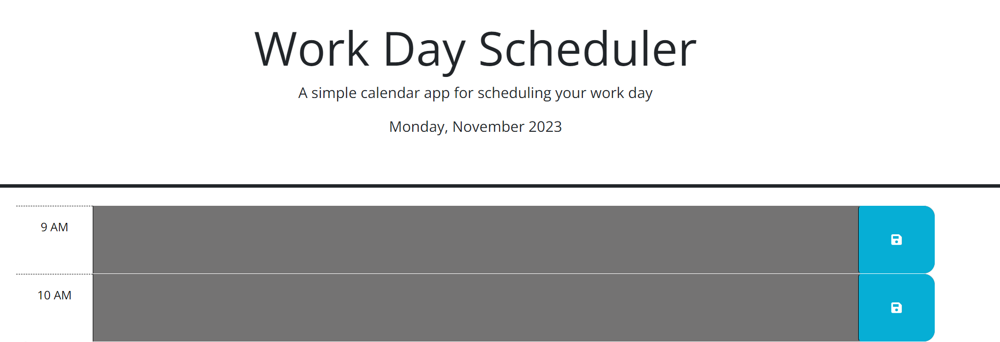

# Work-Day-Schedule

Simple tracker for everyday use.

## Description 

Time slots from 9 am to 5 pm to track different tasks during these times.

## Usage

Enter different events you have for the day into the current time slot. The background color will change to alert the user if the past is past, current, or haven't happened yet.

## Dependencies

1. A web browser
2. Internet
3. <a href="https://mscott-dev.github.io/Work-Day-Schedule/" alt="Link to the Schedule">A link to the webpage</a>

## Installing
N/A

## Executing program

Just enter your tasks and hit save!

## Authors
Matthew Scott
